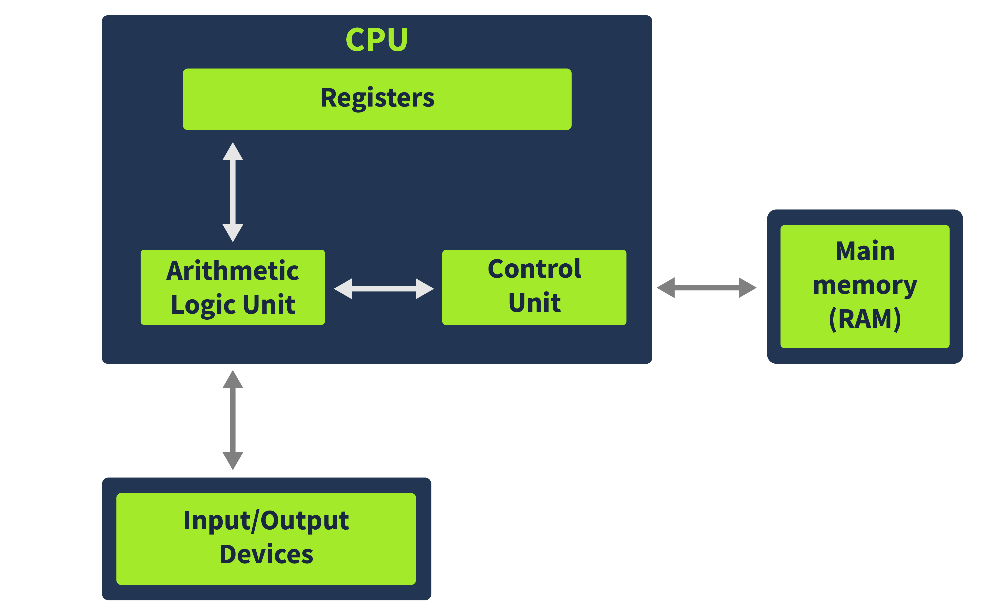

# x86 Architecture Overview

A crash course in x86 architecture to enable us in malware reverse engineering.

**Link** - [https://tryhackme.com/r/room/x8664arch](https://tryhackme.com/r/room/x8664arch)

## Task 1: Introduction

Summing up, we will be covering the following topics in this room.

- Overview of CPU architecture and its components
- Different types of CPU registers and their usage
- Memory layout as viewed by a program
- Stack layout and stack registers

So let's dive into the room and learn about the above-mentioned topics.

Answers:

Go through the Learning Objectives
> No answer needed

## Task 2: CPU Architectures Overview

The CPU architecture that is most widely used is derived from the Von Neumann architecture. A brief overview of this architecture is demonstrated in the below diagram.

Answers:

In which part of the Von Neumann architecture are the code and data required for a program to run stored?

> Memory

What part of the CPU stores small amounts of data?

> Register

In which unit are arithmetic operations performed?

> Arithmetic Logic Unit

## Task 3: Registers Overview

Registers are the CPU's storage medium. The CPU can access data from the registers quicker than any other storage medium; however, its limited size means it has to be used effectively. For this purpose, the registers are divided into the following different types:

- Instruction Pointer
- General Purpose Registers
- Status Flag Registers
- Segment Registers

Answers:

Which register holds the address to the next instruction that is to be executed?

> Instruction Pointer

Which register in a 32-bit system is also called the Counter Register?

> ECX

Which registers from the ones discussed above are not present in a 32-bit system?

> R8-R15

## Task 4: Registers - Continued

When performing execution, some indication about the status of the execution is sometimes required. This is where the Status Flags come in. This is a single 32-bit register for 32-bit systems called EFLAGS, which is extended to 64-bits for 64-bit systems, and called RFLAGS in the 64-bit system. The status flags register consists of individual single-bit flags that can be either 1 or 0.

Answers:

Which flag is used by the program to identify if it is being run in a debugger?

> Trap Flag

Which flag will be set when the most significant bit in an operation is set to 1?

> Sign Flag

Which Segment register contains the pointer to the code section in memory?

> Code Segment

## Task 5: Memory Overview

When a program is loaded into the Memory in the Windows Operating System, it sees an abstracted view of the Memory. This means that the program doesn't have access to the full Memory; instead, it only has access to its Memory. For that program, that is all the Memory it needs. For the sake of brevity, we will not go into the details of how the Operating System performs abstraction. We will look at the Memory as a program sees it, as that is more relevant to us when reverse-engineering malware.

The diagram here is an overview of the typical memory layout for a program. As can be seen, Memory is divided into different sections, namely Stack, Heap, Code, and Data. While we have shown the four sections in a particular order, this can be different from how they will be all the time, e.g., the Code section can be below the Data section.

Answers:

When a program is loaded into Memory, does it have a full view of the system memory? Y or N?

> N

Which section of the Memory contains the code?

> Code

Which Memory section contains information related to the program's control flow?

> Stack

## Task 6: Stack Layout

The Stack is a part of a program's memory that contains the arguments passed to the program, the local variables, and the program's control flow. This makes the stack very important regarding malware analysis and reverse engineering. Malware often exploits the stack to hijack the control flow of the program. Therefore it is important to understand the stack, its layout, and its working.

The stack is a Last In First Out (LIFO) memory. This means that the last element pushed onto the stack is the first one to be popped out. For example, if we push A, B, and C onto the stack, when we pop out these elements, the first to pop out will be C, B, and then A. The CPU uses two registers to keep track of the stack. One is the Stack Pointer (the ESP or RSP), and the other is the Base Pointer (the EBP or RBP).

Answers:

Follow the instructions in the attached static site and find the flag. What is the flag?

> THM{SMASHED_THE_STACK}

## Task 7: Conclusion

That concludes this room on the primer of x86-64 system architecture. In this room, we learned:

- The Von Neumann CPU architecture
- Different components of a CPU
- Different types of CPU registers
- Memory and its different sections
- Stack layout of a program in memory

Answers:

Join the discussion on our social channels

> No answer needed